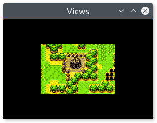

# Controlling the 2D camera with views

## What is a view?

In games, it is not uncommon to have levels which are much bigger than the window itself. You only see is a small part of them. This is typically the case in RPGs, platform games, and many other genres. What developers might tend to forget is that they define entities *in a 2D world*, not directly in the window. The window is just a view, it shows a specific area of the whole world. It is perfectly fine to draw several views of the same world in parallel, or draw the world to a texture rather than to a window. The world itself remains unchanged, what changes is just the way it is seen.

Since what is seen in the window is just a small part of the entire 2D world, you need a way to specify which part of the world is shown in the window. Additionally, you may also want to define where/how this area will be shown *within* the window. These are the two main features of SFML views.

To summarize, views are what you need if you want to scroll, rotate or zoom your world. They are also the key to creating split screens and mini-maps.

## Defining what the view views

The class which encapsulates views in SFML is [SF::View][]. It can be constructed directly with a definition of the area to view:

```crystal
# create a view with the rectangular area of the 2D world to show
view1 = SF::View.new(SF.float_rect(200, 200, 300, 200))

# create a view with its center and size
view2 = SF::View.new(SF.vector2(350, 300), SF.vector2(300, 200))
```

These two definitions are equivalent: Both views will show the same area of the 2D world, a 300x200 rectangle *centered* on the point (350, 300).


If you don't want to define the view upon construction or want to modify it later, you can use the equivalent setters:

```crystal
view1.reset(SF.float_rect(200, 200, 300, 200))

view2.center = SF.vector2(350, 300)
view2.size = SF.vector2(200, 200)
```

Once your view is defined, you can transform it to make it show a translated/rotated/scaled version of your 2D world.

### Moving (scrolling) the view

Unlike drawable entities, such as sprites or shapes whose positions are defined by their top-left corner (and can be changed to any other point), views are always manipulated by their center -- this is simply more convenient. That's why the method to change the position of a view is named `center=`, and not `position=`.

```crystal
# move the view at point (200, 200)
view.center = SF.vector2(200, 200)

# move the view by an offset of (100, 100) (so its final position is (300, 300))
view.move(SF.vector2(100, 100))
```


### Rotating the view

To rotate a view, use the `rotation=` method.

```crystal
# rotate the view at 20 degrees
view.rotation = 20

# rotate the view by 5 degrees relatively to its current orientation (so its final orientation is 25 degrees)
view.rotate(5)
```


### Zooming (scaling) the view

Zooming in (or out) a view is done through to resizing it, so the method to use is `size=`.

```crystal
# resize the view to show a 1200x800 area (we see a bigger area, so this is a zoom out)
view.size = SF.vector2(1200, 800)

# zoom the view relatively to its current size (apply a factor 0.5, so its final size is 600x400)
view.zoom(0.5)
```


## Defining how the view is viewed

Now that you've defined which part of the 2D world is seen in the window, let's define *where* it is shown. By default, the viewed contents occupy the full window. If the view has the same size as the window, everything is rendered 1:1. If the view is smaller or larger than the window, everything is scaled to fit in the window.

This default behavior is suitable for most situations, but it might need to be changed sometimes. For example, to split the screen in a multiplayer game, you may want to use two views which each only occupy half of the window. You can also implement a minimap by drawing your entire world to a view which is rendered in a small area in a corner of the window. The area in which the contents of the view is shown is called the *viewport*.

To set the viewport of a view, you can use the `viewport=` method.

```crystal
# define a centered viewport, with half the size of the window
view.viewport = SF.float_rect(0.25, 0.25, 0.5, 0.5)
```



You might have noticed something very important: The viewport is not defined in pixels, but instead as a ratio of the window size. This is more convenient: It allows you to not have to track resize events in order to update the size of the viewport every time the size of the window changes. It is also more intuitive: You would probably define your viewport as a fraction of the entire window area anyway, not as a fixed-size rectangle.

Using a viewport, it is straightforward to split the screen for multiplayer games:

```crystal
# player 1 (left side of the screen)
player1_view.viewport = SF.float_rect(0, 0, 0.5, 1)

# player 2 (right side of the screen)
player2_view.viewport = SF.float_rect(0.5, 0, 0.5, 1)
```


... or a mini-map:

```crystal
# the game view (full window)
game_view.viewport = SF.float_rect(0, 0, 1, 1)

# mini-map (upper-right corner)
minimap_view.viewport = SF.float_rect(0.75, 0, 0.25, 0.25)
```


## Using a view

To draw something using a view, you must draw it after calling the `view=` method of the target to which you are drawing ([SF::RenderWindow][] or [SF::RenderTexture][]).

```crystal
# let's define a view
view = SF::View.new(SF.float_rect(0, 0, 1000, 600))

# activate it
window.view = view

# draw something to that view
window.draw(some_sprite)

# want to do visibility checks? retrieve the view
current_view = window.view

[...]
```

The view remains active until you set another one. This means that there is always a view which defines what appears in the target, and where it is drawn. If you don't explicitly set any view, the render-target uses its own default view, which matches its size 1:1. You can get the default view of a render-target with the `default_view` method. This can be useful if you want to define your own view based on it, or restore it to draw fixed entities (like a GUI) on top of your scene.

```crystal
# create a view half the size of the default view
view = window.default_view
view.zoom(0.5)
window.view = view

# restore the default view
window.view = window.default_view
```

When you call `view=`, the render-target makes a *copy* of the view, and doesn't store a pointer to the one that is passed. This means that whenever you update your view, you need to call `view=` again to apply the modifications.  
Don't be afraid to copy views or create them on the fly, they aren't expensive objects (they just hold a few floats).

## Showing more when the window is resized

Since the default view never changes after the window is created, the viewed contents are always the same. So when the window is resized, everything is squeezed/stretched to the new size.

If, instead of this default behavior, you'd like to show more/less stuff depending on the new size of the window, all you have to do is update the size of the view with the size of the window.

```crystal
# the event loop
while event = window.poll_event
  [...]

  # catch the resize events
  if event.is_a? SF::Event::Resized
    # update the view to the new size of the window
    visible_area = SF.float_rect(0, 0, event.width, event.height)
    window.view = SF::View.new(visible_area)
  end
end
```

## Coordinates conversions

When you use a custom view, or when you resize the window without using the code above, pixels displayed on the target no longer match units in the 2D world. For example, clicking on pixel (10, 50) may hit the point (26.5, -84) of your world. You end up having to use a conversion method to map your pixel coordinates to world coordinates: `map_pixel_to_coords`.

```crystal
# get the current mouse position in the window
pixel_pos = SF::Mouse.get_position(window)

# convert it to world coordinates
world_pos = window.map_pixel_to_coords(pixel_pos, window.view)
```

By default, `map_pixel_to_coords` uses the current view. If you want to convert the coordinates using view which is not the active one, you can pass it as an additional argument to the method.

The opposite, converting world coordinates to pixel coordinates, is also possible with the `map_coords_to_pixel` method.
