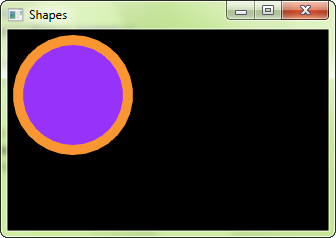
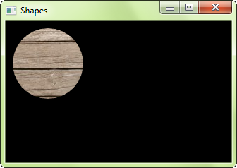
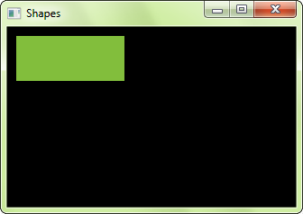
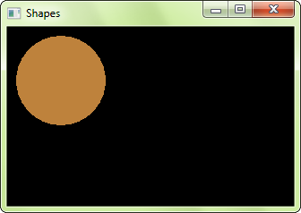
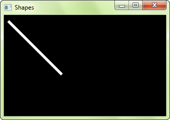

# Shapes

## Introduction

CrSFML provides a set of classes that represent simple shape entities. Each type of shape is a separate class, but they all derive from the same base class so that they have access to the same subset of common features. Each class then adds its own specifics: a radius property for the circle class, a size for the rectangle class, points for the polygon class, etc.

## Common shape properties

### Transformation (position, rotation, scale)

These properties are common to all the CrSFML graphical classes, so they are explained in a separate tutorial: [Transforming entities](graphics-transform.md "'Transforming entities' tutorial").

### Color

One of the basic properties of a shape is its color. You can change with the `fill_color=` function.

```ruby
shape = SF::CircleShape.new(50)

# set the shape color to green
shape.fill_color = SF.color(100, 250, 50)
```


### Outline

Shapes can have an outline. You can set the thickness and color of the outline with the `outline_thickness=` and `setOutlineColor` functions.

```ruby
shape = SF::CircleShape.new(50)
shape.fill_color = SF.color(150, 50, 250)

# set a 10-pixel wide orange outline
shape.outline_thickness = 10
shape.outline_color = SF.color(250, 150, 100)
```



By default, the outline is extruded outwards from the shape (e.g. if you have a circle with a radius of 10 and an outline thickness of 5, the total radius of the circle will be 15). You can make it extrude towards the center of the shape instead, by setting a negative thickness.

To disable the outline, set its thickness to 0. If you only want the outline, you can set the fill color to `SF::Color::Transparent`.

### Texture

Shapes can also be textured, just like sprites. To specify a part of the texture to be mapped to the shape, you must use the `texture_rect=` function. It takes the texture rectangle to map to the bounding rectangle of the shape. This method doesn't offer maximum flexibility, but it is much easier to use than individually setting the texture coordinates of each point of the shape.

```ruby
shape = SF::CircleShape.new(50)

# map a 100x100 textured rectangle to the shape
reset_rect = false # reset texture rect?
shape.set_texture(texture, reset_rect) # texture is a SF::Texture
shape.texture_rect = SF.int_rect(10, 10, 100, 100)
```



Note that the outline is not textured.
It is important to know that the texture is modulated (multiplied) with the shape's fill color. If its fill color is SF::Color::White, the texture will appear unmodified.
To disable texturing, call `set_texture(nil, false)`.

## Drawing a shape

Drawing a shape is as simple as drawing any other CrSFML entity:

```ruby
window.draw(shape)
```

## Built-in shape types

### Rectangles

To draw rectangles, you can use the [RectangleShape]({{book.api}}/RectangleShape.html) class. It has a single attribute: The size of the rectangle.

```ruby
# define a 120x50 rectangle
rectangle = SF::RectangleShape.new(SF.vector2(120, 50))

# change the size to 100x100
rectangle.size = SF.vector2(100, 100)
```



### Circles

Circles are represented by the [CircleShape]({{book.api}}/CircleShape.html) class. It has two attributes: The radius and the number of sides. The number of sides is an optional attribute, it allows you to adjust the "quality" of the circle: Circles have to be approximated by polygons with many sides (the graphics card is unable to draw a perfect circle directly), and this attribute defines how many sides your circle approximation will have. If you draw small circles, you'll probably only need a few sides. If you draw big circles, or zoom on regular circles, you'll most likely need more sides.

```ruby
# define a circle with radius = 200
circle = SF::CircleShape.new(200)

# change the radius to 40
circle.radius = 40

# change the number of sides (points) to 100
circle.point_count = 100
```



### Regular polygons

There's no dedicated class for regular polygons, in fact you can represent a regular polygon with any number of sides using the [CircleShape]({{book.api}}/CircleShape.html) class: Since circles are approximated by polygons with many sides, you just have to play with the number of sides to get the desired polygons. A [CircleShape]({{book.api}}/CircleShape.html) with 3 points is a triangle, with 4 points it's a square, etc.

```ruby
# define a triangle
triangle = SF::CircleShape.new(80, 3)

# define a square
square = SF::CircleShape.new(80, 4)

# define an octagon
octagon = SF::CircleShape.new(80, 8)
```


### Convex shapes

The [ConvexShape]({{book.api}}/ConvexShape.html) class is the ultimate shape class: It allows you to define any *convex* shape. CrSFML is unable to draw concave shapes. If you need to draw a concave shape, you'll have to split it into multiple convex polygons.

To construct a convex shape, you must first set the number of points it should have and then define the points.

```ruby
# create an empty shape
convex = SF::ConvexShape.new

# resize it to 5 points
convex.point_count = 5

# define the points
convex[0] = SF.vector2(0, 0)
convex[1] = SF.vector2(150, 10)
convex[2] = SF.vector2(120, 90)
convex[3] = SF.vector2(30, 100)
convex[4] = SF.vector2(0, 50)
```

The order in which you define the points is very important. They must *all* be defined either in clockwise or counter-clockwise order. If you define them in an inconsistent order, the shape will be constructed incorrectly.


Although the name of [ConvexShape]({{book.api}}/ConvexShape.html) implies that it should only be used to represent convex shapes, its requirements are a little more relaxed. In fact, the only requirement that your shape must meet is that if you went ahead and drew lines from its *center of gravity* to all of its points, these lines must be drawn in the same order. You are not allowed to "jump behind a previous line". Internally, convex shapes are automatically constructed using [triangle fans](http://en.wikipedia.org/wiki/Triangle_fan "Go to Wikipedia's article about triangle fans"), so if your shape is representable by a triangle fan, you can use [ConvexShape]({{book.api}}/ConvexShape.html). With this relaxed definition, you can draw stars using [ConvexShape]({{book.api}}/ConvexShape.html) for example.

### Lines

There's no shape class for lines. The reason is simple: If your line has a thickness, it is a rectangle. If it doesn't, it can be drawn with a line primitive.

Line with thickness:

```ruby
line = SF::RectangleShape.new(SF.vector2(150, 5))
line.rotate(45)
```



Line without thickness:

```ruby
line = [
    SF.vertex(SF.vector2(10, 10)),
    SF.vertex(SF.vector2(150, 150))
]

window.draw(line, SF::Lines)
```


To learn more about vertices and primitives, you can read the tutorial on [vertex arrays](graphics-vertex-array.md "'Vertex arrays' tutorial").

## Custom shape types

[Shape]({{book.api}}/Shape.html) currently [does not work](https://github.com/manastech/crystal/issues/605); use `ConvexShape` (it can be subclassed).

<!--

You can extend the set of shape classes with your own shape types. To do so, you must derive from [Shape]({{book.api}}/Shape.html) and override two functions:

  * `point_count`: return the number of points in the shape
  * `get_point`: return a point of the shape

You must also call the `update()` protected function whenever any point in your shape changes, so that the base class is informed and can update its internal geometry.

Here is a complete example of a custom shape class: `EllipseShape`.

```ruby
class EllipseShape < SF::Shape
    def initialize(@radius = SF.vector2(0, 0))
    end

    def radius
        @radius
    end
    def radius=(radius)
        @radius = radius
        update
    end

    def point_count
        30  # fixed, but could be an attribute of the class if needed
    end

    def get_point(index)
        pi = Math::PI

        angle = index * 2 * pi / point_count - pi / 2
        x = Math.cos(angle) * @radius.x
        y = Math.sin(angle) * @radius.y

        SF.vector2(@radius.x + x, @radius.y + y)
    end
end
```


-->

## Antialiased shapes

There's no option to anti-alias a single shape. To get anti-aliased shapes (i.e. shapes with smoothed edges), you have to enable anti-aliasing globally when you create the window, with the corresponding attribute of the structure.

```ruby
window = SF::RenderWindow.new(
  SF.video_mode(800, 600),
  "CrSFML shapes",
  settings: SF.context_settings(antialiasing: 8)
)
```


Remember that anti-aliasing availability depends on the graphics card: It might not support it, or have it forced to disabled in the driver settings.  
Sometimes antialiasing does not work if `depth_bits` is not specified (use 24 if unsure).
