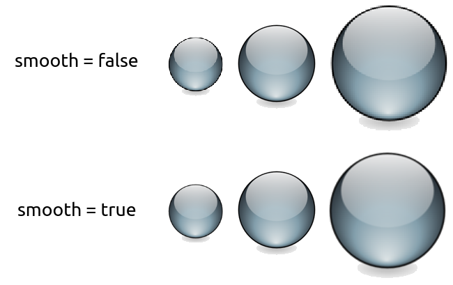
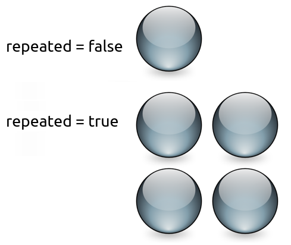

# Sprites and textures

## Vocabulary

Most (if not all) of you are already familiar with these two very common objects, so let's define them very briefly. 

A texture is an image. But we call it "texture" because it has a very specific role: being mapped to a 2D entity. 

A sprite is nothing more than a textured rectangle. 


Ok, that was short but if you really don't understand what sprites and textures are, then you'll find a much better description on Wikipedia. 

## Loading a texture

Before creating any sprite, we need a valid texture. The class that encapsulates textures in SFML is, surprisingly, [Texture]({{book.api}}/Texture.html). Since the only role of a texture is to be loaded and mapped to graphical entities, almost all its functions are about loading and updating it. 

The most common way of loading a texture is from an image file on disk, which is done with the `loadFromFile` function. 

```
sf::Texture texture;
if (!texture.loadFromFile("image.png"))
{
    // error...
}
```

The `loadFromFile` function can sometimes fail with no obvious reason. First, check the error message that SFML prints to the standard output (check the console). If the message is unable to open file, make sure that the *working directory* (which is the directory that any file path will be interpreted relative to) is what you think it is: When you run the application from your desktop environment, the working directory is the executable folder. However, when you launch your program from your IDE (Visual Studio, Code::Blocks, ...) the working directory might sometimes be set to the *project* directory instead. This can usually be changed quite easily in the project settings. 

You can also load an image file from memory (`loadFromMemory`), from a [custom input stream](./system-stream.html "Input streams tutorial") (`loadFromStream`), or from an image that has already been loaded (`loadFromImage`). The latter loads the texture from an [Image]({{book.api}}/Image.html), which is a utility class that helps store and manipulate image data (modify pixels, create transparency channel, etc.). The pixels of an [Image]({{book.api}}/Image.html) stay in system memory, which ensures that operations on them will be as fast as possible, in contrast to the pixels of a texture which reside in video memory and are therefore slow to retrieve or update but very fast to draw. 

SFML supports most common image file formats. The full list is available in the API documentation. 

All these loading functions have an optional argument, which can be used if you want to load a smaller part of the image. 

```
// load a 32x32 rectangle that starts at (10, 10)
if (!texture.loadFromFile("image.png", sf::IntRect(10, 10, 32, 32)))
{
    // error...
}
```

The [IntRect", "Rect]({{book.api}}/IntRect) class is a simple utility type that represents a rectangle. Its constructor takes the coordinates of the top-left corner, and the size of the rectangle. 

If you don't want to load a texture from an image, but instead want to update it directly from an array of pixels, you can create it empty and update it later: 

```
// create an empty 200x200 texture
if (!texture.create(200, 200))
{
    // error...
}
```

Note that the contents of the texture are undefined at this point. 

To update the pixels of an existing texture, you have to use the `update` function. It has overloads for many kinds of data sources: 

```
// update a texture from an array of pixels
sf::Uint8* pixels = new sf::Uint8[width * height * 4]; // * 4 because pixels have 4 components (RGBA)
...
texture.update(pixels);

// update a texture from a sf::Image
sf::Image image;
...
texture.update(image);

// update the texture from the current contents of the window
sf::RenderWindow window;
...
texture.update(window);
```

These examples all assume that the source is of the same size as the texture. If this is not the case, i.e. if you want to update only a part of the texture, you can specify the coordinates of the sub-rectangle that you want to update. You can refer to the documentation for further details. 

Additionally, a texture has two properties that change how it is rendered. 

The first property allows one to smooth the texture. Smoothing a texture makes pixel boundaries less visible (but the image a little more blurry), which can be desirable if it is up-scaled. 

```
texture.setSmooth(true);
```



Since smoothing samples from adjacent pixels in the texture as well, it can lead to the unwanted side effect of factoring in pixels outside the selected texture area. This can happen when your sprite is located at non-integer coordinates. 

The second property allows a texture to be repeatedly tiled within a single sprite. 

```
texture.setRepeated(true);
```



This only works if your sprite is configured to show a rectangle which is larger than the texture, otherwise this property has no effect. 

## Ok, can I have my sprite now?

Yes, you can now create your sprite. 

```
sf::Sprite sprite;
sprite.setTexture(texture);
```

... and finally draw it. 

```
// inside the main loop, between window.clear() and window.display()
window.draw(sprite);
```

If you don't want your sprite to use the entire texture, you can set its texture rectangle. 

```
sprite.setTextureRect(sf::IntRect(10, 10, 32, 32));
```

You can also change the color of a sprite. The color that you set is modulated (multiplied) with the texture of the sprite. This can also be used to change the global transparency (alpha) of the sprite. 

```
sprite.setColor(sf::Color(0, 255, 0)); // green
sprite.setColor(sf::Color(255, 255, 255, 128)); // half transparent
```

These sprites all use the same texture, but have a different color: 


Sprites can also be transformed: They have a position, an orientation and a scale. 

```
// position
sprite.setPosition(sf::Vector2f(10, 50)); // absolute position
sprite.move(sf::Vector2f(5, 10)); // offset relative to the current position

// rotation
sprite.setRotation(90); // absolute angle
sprite.rotate(15); // offset relative to the current angle

// scale
sprite.setScale(sf::Vector2f(0.5f, 2.f)); // absolute scale factor
sprite.scale(sf::Vector2f(1.5f, 3.f)); // factor relative to the current scale
```

By default, the origin for these three transformations is the top-left corner of the sprite. If you want to set the origin to a different point (for example the center of the sprite, or another corner), you can use the `setOrigin` function. 

```
sprite.setOrigin(sf::Vector2f(25, 25));
```

Since transformation functions are common to all SFML entities, they are explained in a separate tutorial: [Transforming entities](./graphics-transform.html "'Transforming entities' tutorial"). 

## The white square problem

You successfully loaded a texture, constructed a sprite correctly, and... all you see on your screen now is a white square. What happened? 

This is a common mistake. When you set the texture of a sprite, all it does internally is store a *pointer* to the texture instance. Therefore, if the texture is destroyed or moves elsewhere in memory, the sprite ends up with an invalid texture pointer. 

This problem occurs when you write this kind of function: 

```
sf::Sprite loadSprite(std::string filename)
{
    sf::Texture texture;
    texture.loadFromFile(filename);

    return sf::Sprite(texture);
} // error: the texture is destroyed here
```

You must correctly manage the lifetime of your textures and make sure that they live as long as they are used by any sprite. 

## The importance of using as few textures as possible

Using as few textures as possible is a good strategy, and the reason is simple: Changing the current texture is an expensive operation for the graphics card. Drawing many sprites that use the same texture will yield the best performance. 

Additionally, using a single texture allows you to group static geometry into a single entity (you can only use one texture per `draw` call), which will be much faster to draw than a set of many entities. Batching static geometry involves other classes and is therefore beyond the scope of this tutorial, for further details see the [vertex array](./graphics-vertex-array.html "Vertex array tutorial") tutorial. 

Try to keep this in mind when you create your animation sheets or your tilesets: Use as little textures as possible. 

## Using sf::Texture with OpenGL code

If you're using OpenGL rather than the graphics entities of SFML, you can still use [Texture]({{book.api}}/Texture.html) as a wrapper around an OpenGL texture object and use it along with the rest if your OpenGL code. 

To bind a [Texture]({{book.api}}/Texture.html) for drawing (basically `glBindTexture`), you call the `bind` static function: 

```
sf::Texture texture;
...

// bind the texture
sf::Texture::bind(&texture);

// draw your textured OpenGL entity here...

// bind no texture
sf::Texture::bind(NULL);
```

