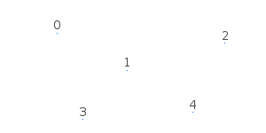

# Designing your own entities with vertex arrays

## Introduction

SFML provides simple classes for the most common 2D entities. And while more complex entities can easily be created from these building blocks, it isn't always the most efficient solution. For example, you'll reach the limits of your graphics card very quickly if you draw a large number of sprites. The reason is that performance depends in large part on the number of calls to the `draw` method. Indeed, each call involves setting a set of OpenGL states, resetting matrices, changing textures, etc. All of this is required even when simply drawing two triangles (a sprite). This is far from optimal for your graphics card: Today's GPUs are designed to process large batches of triangles, typically several thousand to millions.

To fill this gap, SFML provides a lower-level mechanism to draw things: Vertex arrays. As a matter of fact, vertex arrays are used internally by all other SFML classes. They allow for a more flexible definition of 2D entities, containing as many triangles as you need. They even allow drawing points or lines.

## What is a vertex, and why are they always in arrays?

A vertex is the smallest graphical entity that you can manipulate. In short, it is a graphical point: Naturally, it has a 2D position (x, y), but also a color, and a pair of texture coordinates. We'll go into the roles of these attributes later.

Vertices (plural of vertex) alone don't do much. They are always grouped into *primitives*: Points (1 vertex), lines (2 vertices), triangles (3 vertices) or quads (4 vertices). You can then combine multiple primitives together to create the final geometry of the entity.

Now you understand why we always talk about vertex arrays, and not vertices alone.

## A simple vertex array

Let's have a look at the [Vertex]({{book.api}}/Vertex.html) class now. It's simply a container which contains three public members and no functions besides its constructors. These constructors allow you to construct vertices from the set of attributes you care about -- you don't always need to color or texture your entity.

```ruby
# create a new vertex
vertex = SF.vertex

# set its position
vertex.position = SF.vector2(10, 50)

# set its color
vertex.color = SF::Color::Red

# set its texture coordinates
vertex.tex_coords = SF.vector2f(100, 100)
```

... or, using the correct constructor:

```ruby
vertext = SF.vertex(SF.vector2(10, 50), SF::Color::Red, SF.vector2(100, 100))
```

Now, let's define a primitive. Remember, a primitive consists of several vertices, therefore we need a vertex array. CrSFML provides a simple wrapper for this: [VertexArray]({{book.api}}/VertexArray.html). It provides the semantics of an array, and also stores the type of primitive its vertices define.

```ruby
# create an array of 3 vertices that define a triangle primitive
triangle = SF::VertexArray.new(SF::Triangles, 3)

# define the positions and colors of the triangle's points
triangle[0] = SF.vertex(SF.vector2f(10, 10), SF::Color::Red)
triangle[1] = SF.vertex(SF.vector2f(100, 10), SF::Color::Blue)
triangle[2] = SF.vertex(SF.vector2f(100, 100), SF::Color::Green)

# no texture coordinates here, we'll see that later
```

Your triangle is ready and you can now draw it. Drawing a vertex array can be done similar to drawing any other CrSFML entity, by using the `draw` function:

```ruby
window.draw(triangle)
```


You can see that the vertices' color is interpolated to fill the primitive. This is a nice way of creating gradients.

Note that you don't have to use the [VertexArray]({{book.api}}/VertexArray.html) class. It's just defined for convenience, it's nothing more than an array along with a `SF::PrimitiveType`. If you need more flexibility, or a normal (or static) array, you can use your own storage. You must then use the overload of the `draw` function which takes an array of vertices and the primitive type.

```ruby
vertices = [
  SF.vertex(...),
  SF.vertex(...)
]

window.draw(vertices, SF::Lines)
```

## Primitive types

Let's pause for a while and see what kind of primitives you can create. As explained above, you can define the most basic 2D primitives: Point, line, triangle and quad (quad exists merely as a convenience, internally the graphics card breaks it into two triangles). There are also "chained" variants of these primitive types which allow for sharing of vertices among two consecutive primitives. This can be useful because consecutive primitives are often connected in some way.

Let's have a look at the full list:

Primitive type | Description | Example
---|---|---
`SF::Points` |  A set of unconnected points. These points have no thickness: They will always occupy a single pixel, regardless of the current transform and view.  |  
`SF::Lines` |  A set of unconnected lines. These lines have no thickness: They will always be one pixel wide, regardless of the current transform and view.  |  
`SF::LinesStrip` |  A set of connected lines. The end vertex of one line is used as the start vertex of the next one.  |  
`SF::Triangles` |  A set of unconnected triangles.  |  
`SF::TrianglesStrip` |  A set of connected triangles. Each triangle shares its two last vertices with the next one.  |  
`SF::TrianglesFan` |  A set of triangles connected to a central point. The first vertex is the center, then each new vertex defines a new triangle, using the center and the previous vertex.  |  
`SF::Quads` |  A set of unconnected quads. The 4 points of each quad must be defined consistently, either in clockwise or counter-clockwise order.  |  

## Texturing

Like other SFML entities, vertex arrays can also be textured. To do so, you'll need to manipulate the `tex_coords` attribute of the vertices. This attribute defines which pixel of the texture is mapped to the vertex.

```ruby
# create a quad
quad = SF::VertexArray.new(SF::Quads, 4)

# define it as a rectangle, located at (10, 10) and with size 100x100
# define its texture area to be a 25x50 rectangle starting at (0, 0)
quad.append SF.vertex({ 10,  10}, tex_coords: { 0,  0})
quad.append SF.vertex({110,  10}, tex_coords: {25,  0})
quad.append SF.vertex({110, 110}, tex_coords: {25, 50})
quad.append SF.vertex({ 10, 110}, tex_coords: { 0, 50})
```

Texture coordinates are defined in *pixels* (just like the `texture_rect` of sprites and shapes). They are *not* normalized (between 0 and 1), as people who are used to OpenGL programming might expect.

Vertex arrays are low-level entities, they only deal with geometry and do not store additional attributes like a texture. To draw a vertex array with a texture, you must pass it directly to the `draw` method, through a [RenderStates]({{book.api}}/RenderStates.html) object:

```ruby
vertices = ... # SF::VertexArray
texture = ... # SF::Texture

...

states = SF::RenderStates.new
states.texture = texture

window.draw(vertices, states)
```

## Transforming a vertex array

Transforming is similar to texturing. The transform is not stored in the vertex array, you must pass it to the `draw` method.

```ruby
vertices = ... # SF::VertexArray
transform = ... # SF::Transform

...

states = SF::RenderStates.new
states.transform = transform

window.draw(vertices, states)
```

To know more about transformations and the [Transform]({{book.api}}/Transform.html) class, you can read the tutorial on [transforming entities](graphics-transform.md "Transforming entities tutorial").

## Creating an SFML-like entity

Now that you know how to define your own textured/colored/transformed entity, wouldn't it be nice to wrap it in a CrSFML-style class? Writing a `draw` method allows you to draw instances of your class the same way as CrSFML classes:

```ruby
class MyEntity
  def draw(target, states)
  end
end

entity = MyEntity.new
window.draw(entity) # internally calls entity.draw
```

Including the [TransformableM]({{book.api}}/TransformableM.html) module automatically adds the same transformation methods to your class as other CrSFML classes (`position=`, `rotation=`, `move`, `scale`, ...). You can learn more about this in the tutorial on [transforming entities](graphics-transform.md "Transforming entities tutorial").

Using these two features and a vertex array (in this example we'll also add a texture), here is what a typical CrSFML-like graphical class would look like:

```ruby
class MyEntity
  include SF::TransformableM

  # add methods to play with the entity's geometry / colors / texturing...

  def draw(target, states)
    # apply the entity's transform -- combine it with the one that was passed by the caller
    states.transform *= transform # transform() is defined by SF::Transformable

    # apply the texture
    states.texture = @texture

    # you may also override states.shader or states.blend_mode if you want

    # draw the vertex array
    target.draw(@vertices, states)
  end
end
```

You can then use this class as if it were a built-in CrSFML class:

```ruby
entity = MyEntity.new

# you can transform it
entity.position = SF.vector2(10, 50)
entity.rotation = 45

# you can draw it
window.draw(entity)
```

## Example: tile map

Relevant example: **[minesweeper]({{book.examples2}}/minesweeper)**

With what we've seen above, let's create a class that encapsulates a tile map. The whole map will be contained in a single vertex array, therefore it will be super fast to draw. Note that we can apply this strategy only if the whole tile set can fit into a single texture. Otherwise, we would have to use at least one vertex array per texture.

```ruby
class TileMap
  include SF::TransformableM

  def load(tileset, tile_size, tiles, width, height)
    # load the tileset texture
    @tileset = SF::Texture.from_file(tileset)

    # resize the vertex array to fit the level size
    @vertices = SF::VertexArray.new(SF::Quads)

    # populate the vertex array, with one quad per tile
    (0...width).each do |i|
      (0...height).each do |j|
        # get the current tile number
        tile_number = tiles[i + j * width]

        # find its position in the tileset texture
        tu = tile_number % (@tileset.size.x / tile_size.x)
        tv = tile_number / (@tileset.size.x / tile_size.x)

        # define its 4 corners and texture coordinates
        @vertices.append SF.vertex({i * tile_size.x, j * tile_size.y},
          tex_coords={tu * tile_size.x, tv * tile_size.y})
        @vertices.append SF.vertex({(i + 1) * tile_size.x, j * tile_size.y},
          tex_coords={(tu + 1) * tile_size.x, tv * tile_size.y})
        @vertices.append SF.vertex({(i + 1) * tile_size.x, (j + 1) * tile_size.y},
          tex_coords={(tu + 1) * tile_size.x, (tv + 1) * tile_size.y)})
        @vertices.append SF.vertex({i * tile_size.x, (j + 1) * tile_size.y},
          tex_coords={tu * tile_size.x, (tv + 1) * tile_size.y})
      end
    end
  end

  def draw(target, states)
    # apply the transform
    states.transform *= transform()

    # apply the tileset texture
    states.texture = @tileset

    # draw the vertex array
    target.draw(@vertices, states)
  end
end
```

And now, the application that uses it:

```ruby
# create the window
window = SF::RenderWindow.new(SF.video_mode(512, 256), "Tilemap")

# define the level with an array of tile indices
level = [
  0, 0, 0, 0, 0, 0, 1, 1, 1, 1, 1, 1, 1, 1, 1, 1,
  0, 1, 1, 1, 1, 1, 1, 0, 0, 0, 0, 2, 0, 0, 0, 0,
  1, 1, 0, 0, 0, 0, 0, 0, 3, 3, 3, 3, 3, 3, 3, 3,
  0, 1, 0, 0, 2, 0, 3, 3, 3, 0, 1, 1, 1, 0, 0, 0,
  0, 1, 1, 0, 3, 3, 3, 0, 0, 0, 1, 1, 1, 2, 0, 0,
  0, 0, 1, 0, 3, 0, 2, 2, 0, 0, 1, 1, 1, 1, 2, 0,
  2, 0, 1, 0, 3, 0, 2, 2, 2, 0, 1, 1, 1, 1, 1, 1,
  0, 0, 1, 0, 3, 2, 2, 2, 0, 0, 0, 0, 1, 1, 1, 1
]

# create the tilemap from the level definition
map = TileMap.new
map.load("tileset.png", SF.vector2(32, 32), level, 16, 8)

# run the main loop
while window.open?

  # handle events
  while event = window.poll_event
    if event.type == SF::Event::Closed
      window.close
    end
  end

  # draw the map
  window.clear
  window.draw(map)
  window.display
end
```


## Example: particle system

This second example implements another common entity: The particle system. This one is very simple, with no texture and as few parameters as possible. It demonstrates the use of the `SF::Points` primitive type with a dynamic vertex array which changes every frame.

```ruby
class Particle
  def initialize(@velocity, @lifetime, @position)
    @total_lifetime = @lifetime
  end
  property velocity, lifetime, position
  getter total_lifetime
end

class ParticleSystem
  include SF::TransformableM

  def initialize(@count)
    @particles = [] of Particle
    @emitter = SF.vector2(0, 0)
  end

  property emitter

  def update(elapsed)
    @particles.reject! do |p|
      # update the position of the particle
      p.position += p.velocity * elapsed.as_seconds

      # update the particle lifetime
      p.lifetime -= elapsed
      # if the particle is dead, remove it
      p.lifetime <= SF::Time::Zero
    end
    while @particles.size < @count
      @particles << new_particle
    end
  end

  def draw(target, states)
    vertices = @particles.map do |p|
      # set the alpha (transparency) of the particle according to its lifetime
      ratio = p.lifetime / p.total_lifetime
      color = SF.color(255, 255, 255, (ratio * 255).to_u8)

      SF.vertex(p.position, color)
    end

    #apply the transform
    states.transform *= transform()

    # our particles don't use a texture
    states.texture = nil

    # draw the vertex array
    target.draw(vertices, SF::Points, states)
  end

  private def new_particle
    # give a random velocity and lifetime to the particle
    angle = rand(360) * Math::PI / 180.0
    speed = rand(50) + 50.0
    velocity = SF.vector2(Math.cos(angle) * speed, Math.sin(angle) * speed)
    lifetime = SF.milliseconds(rand(2000) + 1000)
    position = @emitter

    Particle.new(velocity, lifetime, @emitter)
  end
end
```

And a little demo that uses it:

```ruby
# create the window
window = SF::RenderWindow.new(SF.video_mode(800, 600), "Particles")

# create the particle system
particles = ParticleSystem.new(1000)

# create a clock to track the elapsed time
clock = SF::Clock.new

# run the main loop
while window.open?

  # handle events
  while event = window.poll_event
    if event.type == SF::Event::Closed
      window.close
    end
  end

  # make the particle system emitter follow the mouse
  mouse = SF::Mouse.get_position(window)
  particles.emitter = window.map_pixel_to_coords(mouse)

  # update it
  elapsed = clock.restart
  particles.update(elapsed)

  # draw it
  window.clear
  window.draw(particles)
  window.display
end
```


